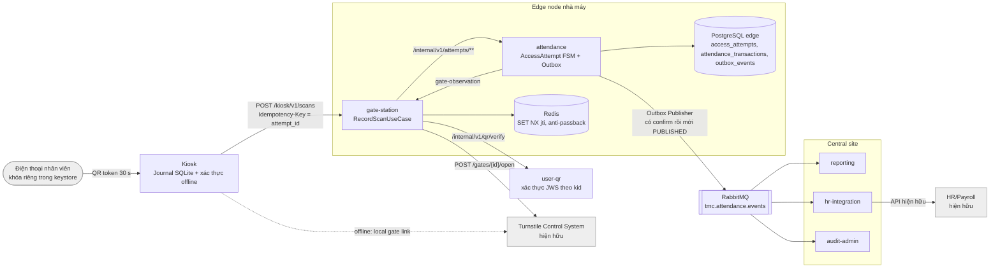
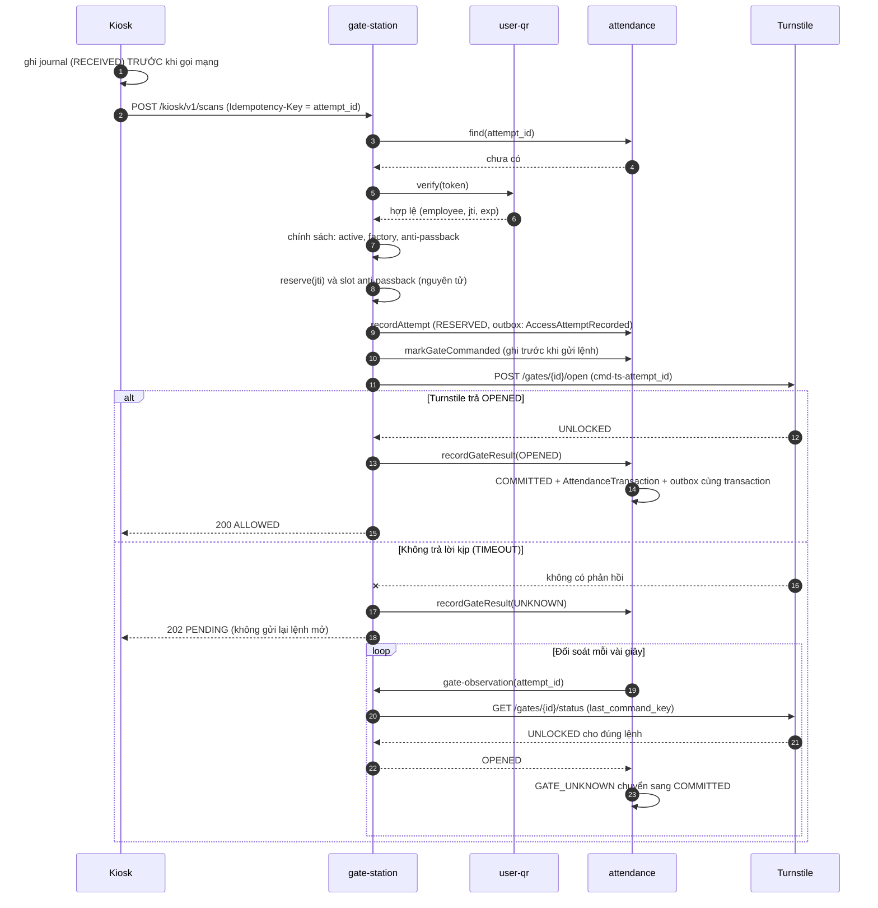

# Sơ đồ tại biên (một nhà máy)

Hai sơ đồ dưới đây phản ánh **mã hiện tại**. Khi mã đổi, sửa sơ đồ trong cùng PR.

## Thành phần và kết nối

```mermaid
flowchart LR
  phone([Điện thoại nhân viên<br/>khóa riêng trong keystore]):::ext
  kiosk[Kiosk<br/>Journal SQLite + xác thực offline]
  subgraph edge[Edge node nhà máy]
    gate[gate-station<br/>RecordScanUseCase]
    att[attendance<br/>AccessAttempt FSM + Outbox]
    redis[(Redis<br/>SET NX jti, anti-passback)]
    pg[(PostgreSQL edge<br/>access_attempts, attendance_transactions, outbox_events)]
  end
  qr[user-qr<br/>xác thực JWS theo kid]
  turn[Turnstile Control System<br/>hiện hữu]:::ext
  broker[[RabbitMQ<br/>tmc.attendance.events]]
  subgraph central[Central site]
    rep[reporting]
    hr[hr-integration]
    aud[audit-admin]
  end
  hrp[HR/Payroll<br/>hiện hữu]:::ext

  phone -- "QR token 30 s" --> kiosk
  kiosk -- "POST /kiosk/v1/scans<br/>Idempotency-Key = attempt_id" --> gate
  kiosk -. "offline: local gate link" .-> turn
  gate -- "/internal/v1/qr/verify" --> qr
  gate --> redis
  gate -- "/internal/v1/attempts/**" --> att
  gate -- "POST /gates/{id}/open" --> turn
  att --> pg
  att -- "Outbox Publisher<br/>có confirm rồi mới PUBLISHED" --> broker
  att -- "gate-observation" --> gate
  broker --> rep
  broker --> hr
  broker --> aud
  hr -- "API hiện hữu" --> hrp
  classDef ext fill:#eee,stroke:#999
```

## Luồng quét thành công và nhánh timeout

```mermaid
sequenceDiagram
  autonumber
  participant K as Kiosk
  participant G as gate-station
  participant Q as user-qr
  participant A as attendance
  participant T as Turnstile
  K->>K: ghi journal (RECEIVED) TRƯỚC khi gọi mạng
  K->>G: POST /kiosk/v1/scans (Idempotency-Key = attempt_id)
  G->>A: find(attempt_id)
  A-->>G: chưa có
  G->>Q: verify(token)
  Q-->>G: hợp lệ (employee, jti, exp)
  G->>G: chính sách: active, factory, anti-passback
  G->>G: reserve(jti) và slot anti-passback (nguyên tử)
  G->>A: recordAttempt (RESERVED, outbox: AccessAttemptRecorded)
  G->>A: markGateCommanded (ghi trước khi gửi lệnh)
  G->>T: POST /gates/{id}/open (cmd-ts-attempt_id)
  alt Turnstile trả OPENED
    T-->>G: UNLOCKED
    G->>A: recordGateResult(OPENED)
    A->>A: COMMITTED + AttendanceTransaction + outbox cùng transaction
    G-->>K: 200 ALLOWED
  else Không trả lời kịp (TIMEOUT)
    T--xG: không có phản hồi
    G->>A: recordGateResult(UNKNOWN)
    G-->>K: 202 PENDING (không gửi lại lệnh mở)
    loop Đối soát mỗi vài giây
      A->>G: gate-observation(attempt_id)
      G->>T: GET /gates/{id}/status (last_command_key)
      T-->>G: UNLOCKED cho đúng lệnh
      G-->>A: OPENED
      A->>A: GATE_UNKNOWN chuyển sang COMMITTED
    end
  end
```
